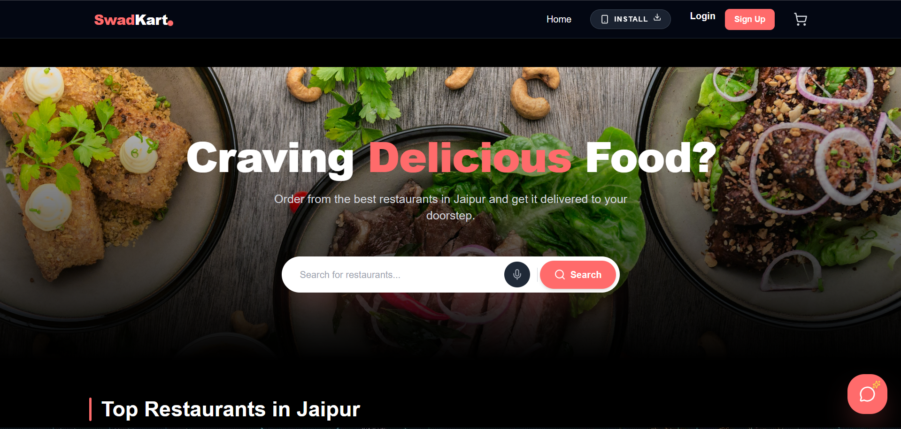
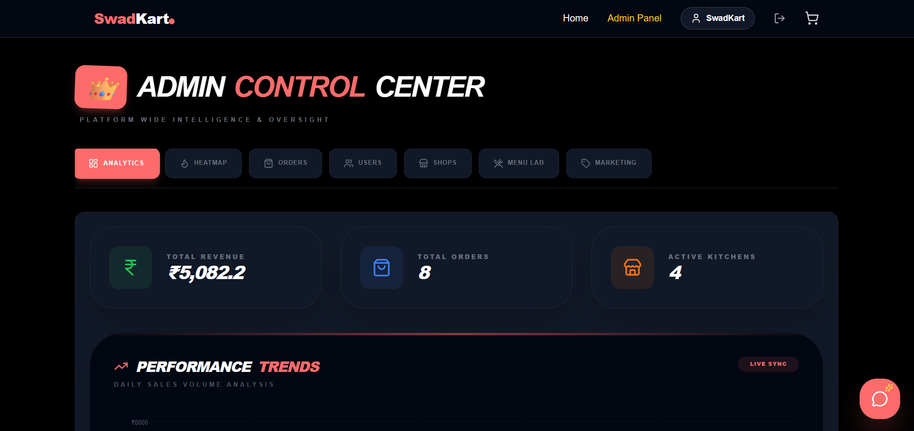
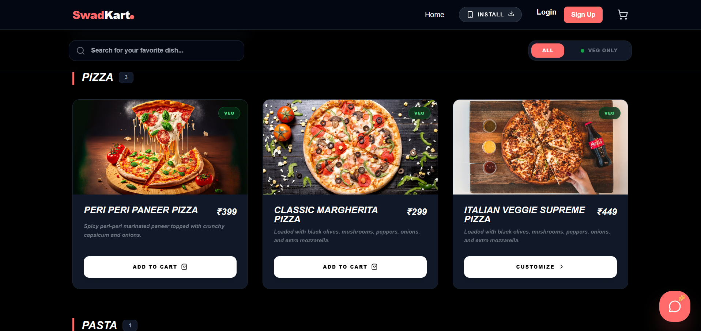
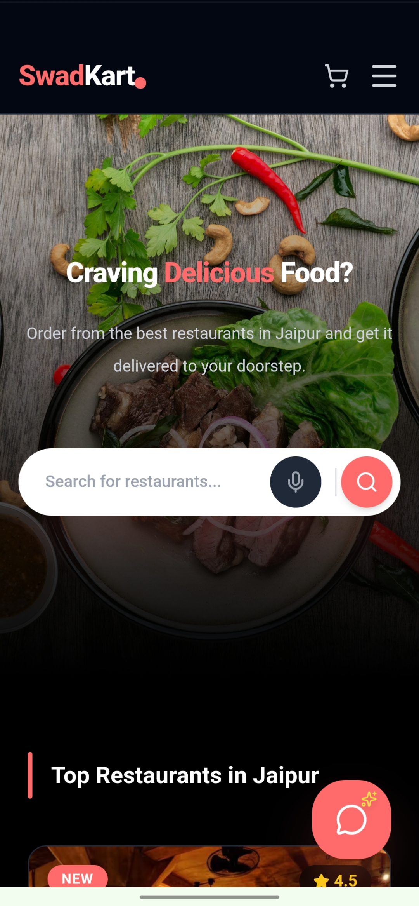
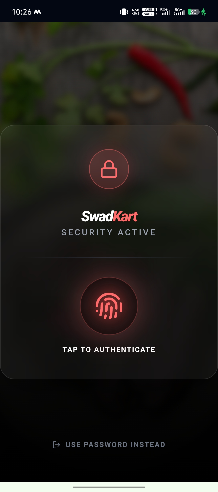
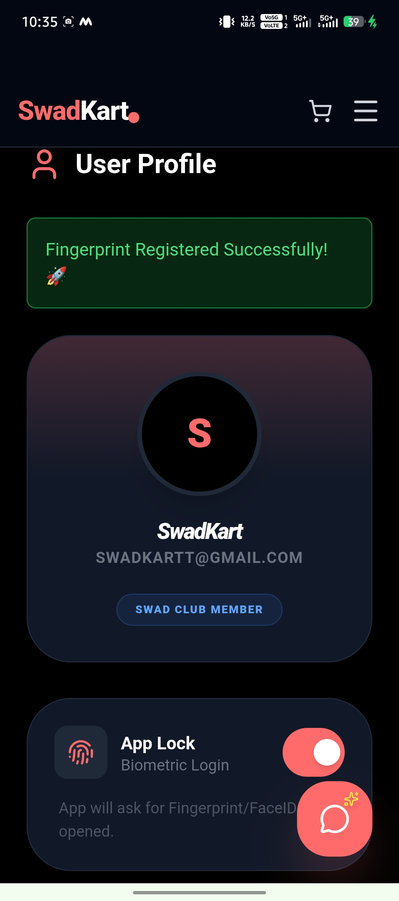

<div align="center">

  

  # SwadKart
  
  **Next-Gen Multi-Vendor Food Delivery Platform | Built at Jagannath University, Jaipur**

  <div>
    <a href="https://swadkart.vercel.app/">
      
    </a>
    <a href="https://github.com/theunstopabble/SwadKart-pro">
      
    </a>
    
  </div>

  <p align="center">
    <br />
    
    
    
    
    
    
    
  </p>
</div>

---

## 📖 About The Project

**SwadKart** is a scalable, full-stack food delivery application designed to connect hungry users with the best local restaurants in Jaipur. It features a sophisticated **multi-role ecosystem** (Admin, Restaurant Owner, Delivery Partner, and User) powered by the MERN stack.

Unlike simple clones, SwadKart includes production-grade features like **Real-time Order Tracking (Socket.io)**, **Interactive Heatmaps for Demand Analysis**, **Live Revenue Analytics**, and a **Secure Role-Based Authentication System**.

### 📸 Application Previews

| **Home Page & Discovery** | **Admin Dashboard & Analytics** |
|:-------------------------:|:---------------------:|
|  |  |

| **Dynamic Menu Lab** | **Mobile Responsive** |
|:-------------------:|:---------------------:|
|  |  |

---

## 🌟 Key Features

### 🛍️ User Experience
* **Smart Discovery:** Filter restaurants by delivery time, rating, and cuisine type.
* **Dynamic Cart:** Real-time price calculation with Redux state management.
* **Secure Auth:** Hybrid authentication using **JWT** (Email/Password) and **Firebase** (Google Auth).
* **Order Tracking:** Real-time updates from "Preparing" to "Out for Delivery".

### 👑 Admin Command Center
* **Live Analytics:** Visual charts for Revenue, Orders, and Active Users.
* **Demand Heatmap:** Interactive map using `Leaflet.js` to visualize high-demand zones.
* **User Management:** Role-based access control to manage Users, Merchants, and Riders.
* **Coupon Engine:** Create and manage discount codes dynamically.

### 🏪 Restaurant & Delivery
* **Menu Lab:** Restaurant owners can manage stock, add variants, and toggle availability.
* **Delivery Dashboard:** dedicated interface for riders to accept/reject orders and verify delivery via **Secure OTP**.

### 🔐 Biometric Security Suite (New v2.0)
* **One-Tap Login:** Authenticate using your device's native Fingerprint or FaceID sensor (WebAuthn).
* **Premium App Lock:** Protect your wallet and order history with a banking-grade "Glassmorphism" lock screen.
* **Smart Hardware Detection:** The UI automatically adapts if the device lacks biometric hardware.
* **Dynamic Environment:** Securely handles authentication across Localhost and Production.

| **Premium Lock Screen** | **Profile Control Center** |
|:-------------------:|:---------------------:|
|  |  |

---

## 🏗️ Architecture & Tech Stack

The project follows a clean **MVC (Model-View-Controller)** architecture with a clear separation of concerns.

### **Frontend (`/frontend`)**
* **Framework:** React.js (Vite)
* **State Management:** Redux Toolkit
* **Styling:** Tailwind CSS + Lucide React Icons
* **Routing:** React Router DOM
* **Real-time:** Socket.io-client

### **Backend (`/backend`)**
* **Runtime:** Node.js
* **Framework:** Express.js
* **Database:** MongoDB Atlas (Mongoose ODM)
* **Authentication:** JWT + Firebase Admin SDK
* **Real-time:** Socket.io
* **Email:** Nodemailer (SMTP)

---

## 🚀 Getting Started

Follow these steps to set up SwadKart locally.

### Prerequisites
* Node.js (v18+)
* MongoDB Connection String (Atlas)
* Google Firebase Project (for Auth)

### 1. Clone the Repository
```bash
git clone https://github.com/theunstopabble/SwadKart-pro.git

```
2. Backend Setup
Navigate to the backend folder and install dependencies:
```bash
cd backend
npm install
```
Create a .env file in /backend and add the following:
```env
PORT=8000
MONGO_URI=your_mongodb_connection_string
JWT_SECRET=your_super_secret_key
JWT_EXPIRE=30d
NODE_ENV=development


# Email Service (For OTPs)
SMTP_HOST=smtp.gmail.com
SMTP_PORT=465
SMTP_MAIL=your_email@gmail.com
SMTP_PASSWORD=your_app_password

# Frontend URL (For CORS)
FRONTEND_URL=http://localhost:5173

# Biometric Config (CRITICAL)
RP_ID=localhost                     # Or your Vercel Domain (e.g., swadkart.vercel.app)
RP_NAME=SwadKart
```
Start the backend server:
```bash
node server.js
```
3. Frontend Setup
Open a new terminal, navigate to frontend, and install dependencies:
```bash
cd frontend
npm install
```
Create a .env file in /frontend:
```env
VITE_API_URL=http://localhost:5000
VITE_FIREBASE_API_KEY=your_firebase_key
VITE_FIREBASE_AUTH_DOMAIN=your_project.firebaseapp.com
VITE_FIREBASE_PROJECT_ID=your_project_id
```
Start the React application:
```bash
npm run dev
```
### 📂 Project Structure
```bash
SwadKart-pro/
├── backend/
│   ├── config/         # DB & Cloudinary Config
│   ├── controllers/    # Logic for User, Order, Admin, Delivery
│   ├── middleware/     # Auth & Error Handling
│   ├── models/         # Mongoose Schemas (User, Order, Product)
│   ├── routes/         # API Endpoints
│   └── utils/          # Email Templates, Token Generators
│
└── frontend/
    ├── src/
    │   ├── components/ # Reusable UI (Admin Tabs, Maps, Charts)
    │   ├── pages/      # Main Views (Dashboard, Cart, Login)
    │   ├── redux/      # Global State (Cart, User Slice)
    │   └── utils/      # Helpers
```
### 🛡️ Security & Performance###
Rate Limiting: Protects API endpoints from abuse.
Data Sanitization: Prevents NoSQL injection.
Secure OTP: Delivery verification uses crypto-generated 4-digit codes.
Lazy Loading: React components load only when needed for faster performance.

---

## 📞 Contact & Support

<div align="left">
  <p><strong>Author:</strong> Gautam Kumar</p>
  <p><strong>Institution:</strong> Jagannath University, Jaipur, Rajasthan, India</p>

  <a href="https://linkedin.com/in/gautamkr62" target="_blank">
    
  </a>
  <a href="https://github.com/theunstopabble" target="_blank">
    
  </a>
  <a href="https://x.com/_unstopabble" target="_blank">
    
  </a>
  
</div>

<br />

> **Note:** If you are interested in collaborating on this project or have any queries, feel free to reach out via any of the platforms above. 🚀

<div align="center"> <i>Built with ❤️ & Code. If you find this useful, please give it a ⭐!</i> </div>
