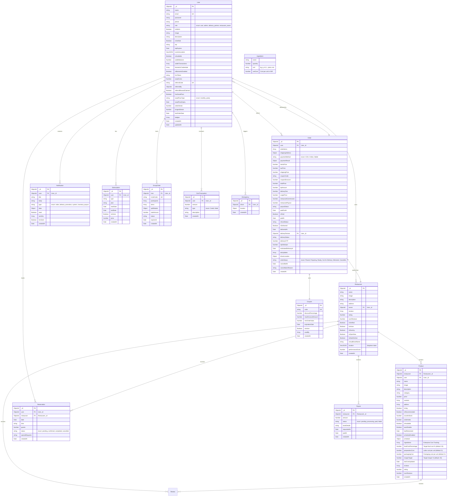

# SwadKart Database Schema

## Entity Relationship Diagram



---

## Collections Detail

### 🧑 Users (`users`)

```javascript
{
  _id: ObjectId,
  name: String,            // required, 2-50 chars
  email: String,           // required, unique, lowercase
  password: String,        // required, min 6 chars, bcrypt hashed
  phone: String,          // required, 10 digits
  role: String,           // enum: "user", "admin", "delivery_partner", "restaurant_owner"
  isAdmin: Boolean,       // auto-set from role === "admin"
  image: String,           // profile picture URL

  // Verification
  isVerified: Boolean,     // default false
  otp: String,             // 6-digit OTP
  otpExpires: Date,        // OTP expiry time
  resetPasswordToken: String,
  resetPasswordExpire: Date,

  // Location (delivery partners)
  currentLocation: {
    type: "Point",
    coordinates: [longitude, latitude]  // GeoJSON
  },
  isAvailable: Boolean,    // for delivery partners

  // Wallet
  walletBalance: Number,   // default 0
  walletTransactions: [{
    amount: Number,
    type: "Credit" | "Debit",
    description: String,
    date: Date
  }],

  // Biometric Auth
  biometricCredentials: [{
    credentialID: String,
    credentialPublicKey: Buffer,
    counter: Number,
    transports: [String],
    deviceType: String,
    backedUp: Boolean
  }],
  currentChallenge: String,
  isBiometricEnabled: Boolean,

  // Notifications
  fcmToken: String,        // Firebase Cloud Messaging token

  // SwadCoins (Loyalty)
  swadCoins: Number,       // default 0

  // Referral
  referralCode: String,    // unique, uppercase, auto-generated
  pendingReferralCode: String,
  referredBy: ObjectId,    // ref: User
  referralRewardClaimed: Boolean,

  // SwadPass
  hasSwadPass: Boolean,
  swadPassType: "monthly" | "yearly",
  swadPassExpiry: Date,
  swadPassStartedAt: Date,

  // Gamification
  orderStreak: Number,
  longestStreak: Number,
  lastOrderDate: Date,
  badges: [{
    name: String,
    description: String,
    earnedAt: Date,
    icon: String
  }],

  createdAt: Date,
  updatedAt: Date
}

// Indexes
db.users.createIndex({ email: 1 }, { unique: true })
db.users.createIndex({ role: 1 })
db.users.createIndex({ currentLocation: "2dsphere" })
db.users.createIndex({ referralCode: 1 }, { unique: true, sparse: true })
```

---

### 🏪 Restaurants (`restaurants`)

```javascript
{
  _id: ObjectId,
  name: String,
  image: String,           // default placeholder
  description: String,
  address: String,
  owner: ObjectId,        // ref: User (restaurant_owner role)

  // Reviews
  reviews: [{
    name: String,
    rating: Number,
    comment: String,
    user: ObjectId
  }],
  rating: Number,         // calculated average
  numReviews: Number,

  // Flags
  isVerified: Boolean,    // admin must approve
  isActive: Boolean,      // soft enable/disable
  isDummy: Boolean,       // for testing
  isOpenNow: Boolean,

  // Dark Kitchen
  isDarkKitchen: Boolean,
  virtualBrandName: String,
  cloudKitchenId: String,

  // Timings
  openingTime: String,    // "09:00"
  closingTime: String,    // "23:00"

  // GeoJSON (2dsphere)
  location: {
    type: "Point",
    coordinates: [longitude, latitude]
  },

  // Performance Score
  performanceScore: Number,  // 0-100
  scoreMetrics: {
    deliveryTimeScore: Number,
    ratingScore: Number,
    volumeScore: Number,
    cancellationScore: Number,
    lastCalculatedAt: Date
  },

  createdAt: Date,
  updatedAt: Date
}

// Indexes
db.restaurants.createIndex({ owner: 1 })
db.restaurants.createIndex({ isVerified: 1 })
db.restaurants.createIndex({ isActive: 1 })
db.restaurants.createIndex({ location: "2dsphere" })
```

---

### 🍔 Products (`products`)

```javascript
{
  _id: ObjectId,
  restaurant: ObjectId,   // ref: Restaurant
  user: ObjectId,         // ref: User (owner)

  name: String,
  image: String,
  description: String,
  category: String,
  price: Number,

  // Customization
  variants: [{
    name: String,
    price: Number
  }],
  addons: [{
    name: String,
    price: Number
  }],

  // Settings
  isVeg: Boolean,
  isRecommended: Boolean,
  countInStock: Number,
  orderIndex: Number,

  // Smart Inventory
  isAvailable: Boolean,
  autoDisable: Boolean,   // auto-disable when stock hits 0
  lastRestocked: Date,

  // Availability Scheduling
  scheduleEnabled: Boolean,
  schedule: {
    days: ["Mon", "Tue", "Wed", "Thu", "Fri", "Sat", "Sun"],
    startTime: String,    // "09:00"
    endTime: String       // "23:00"
  },

  // Reviews
  reviews: [{
    user: ObjectId,
    name: String,
    rating: Number,
    comment: String
  }],
  rating: Number,
  numReviews: Number,

  createdAt: Date,
  updatedAt: Date
}

// Indexes
db.products.createIndex({ restaurant: 1 })
db.products.createIndex({ category: 1 })
db.products.createIndex({ name: "text" })  // full-text search
```

---

### 📦 Orders (`orders`)

```javascript
{
  _id: ObjectId,
  user: ObjectId,         // ref: User

  orderItems: [{
    name: String,
    qty: Number,
    image: String,
    price: Number,
    product: ObjectId,
    restaurant: ObjectId,
    selectedVariant: Object,
    selectedAddons: [Object]
  }],

  shippingAddress: {
    fullName: String,
    address: String,
    city: String,
    postalCode: String,
    country: String,
    state: String,
    phone: String,
    lat: Number,
    lng: Number
  },

  paymentMethod: String,  // "COD" | "Online" | "Wallet"
  paymentResult: {
    id: String,
    status: String,
    update_time: String,
    email_address: String
  },

  // Pricing
  itemsPrice: Number,
  taxPrice: Number,
  shippingPrice: Number,
  couponCode: String,
  couponDiscount: Number,
  totalPrice: Number,
  tipAmount: Number,
  deliveryFee: Number,
  surgePrice: Number,

  // Payout
  restaurantCommission: Number,
  restaurantPayout: Number,
  payoutStatus: String,   // "pending" | "processing" | "paid" | "failed"
  paidOutAt: Date,

  // Payment Status
  isPaid: Boolean,
  paidAt: Date,
  refundStatus: String,   // "None" | "Pending" | "Processed" | "Failed"

  // Delivery
  isDelivered: Boolean,
  deliveredAt: Date,
  deliveryPartner: ObjectId,  // ref: User (delivery_partner)
  deliveryStatus: String,     // "None" | "Assigned" | "Accepted" | "Rejected" | "Out for Delivery" | "Delivered"
  deliveryOTP: Number,        // crypto.randomInt(1000, 9999)
  otpAttempts: Number,

  // ETA
  estimatedDeliveryAt: Date,
  etaUpdates: [{
    timestamp: Date,
    estimatedMinutes: Number,
    reason: String
  }],

  // Driver Location
  driverLocation: {
    lat: Number,
    lng: Number,
    updatedAt: Date,
    heading: Number,
    speed: Number
  },

  // Lifecycle
  orderStatus: String,   // "Placed" | "Preparing" | "Ready" | "Out for Delivery" | "Delivered" | "Cancelled"
  cancelledAt: Date,
  cancellationReason: String,

  createdAt: Date,
  updatedAt: Date
}

// Indexes
db.orders.createIndex({ user: 1 })
db.orders.createIndex({ "orderItems.restaurant": 1 })
db.orders.createIndex({ orderStatus: 1 })
db.orders.createIndex({ createdAt: -1 })
```

---

### 🎫 Coupons (`coupons`)

```javascript
{
  _id: ObjectId,
  code: String,           // unique, uppercase
  discountPercentage: Number,  // 1-100
  maxDiscountAmount: Number,   // cap in ₹
  minOrderValue: Number,       // minimum cart value
  expirationDate: Date,
  isActive: Boolean,
  usedBy: [ObjectId],     // ref: User[] (prevent reuse)

  createdAt: Date,
  updatedAt: Date
}

// Indexes
db.coupons.createIndex({ code: 1 }, { unique: true })
```

---

### 🔔 Notifications (`notifications`)

```javascript
{
  _id: ObjectId,
  user: ObjectId,         // ref: User
  title: String,
  body: String,
  type: String,          // "order" | "delivery" | "promotion" | "system" | "inventory" | "payout"
  data: Mixed,          // arbitrary payload
  read: Boolean,
  sentVia: [String],     // "push" | "email" | "sms" | "in_app"
  fcmSent: Boolean,
  fcmResponse: String,

  createdAt: Date,
  updatedAt: Date
}

// Indexes
db.notifications.createIndex({ user: 1, createdAt: -1 })
db.notifications.createIndex({ user: 1, read: 1 })
db.notifications.createIndex({ user: 1 })
```

---

### 🎟️ Subscriptions (`subscriptions`)

```javascript
{
  _id: ObjectId,
  user: ObjectId,
  type: String,
  plan: String,
  startDate: Date,
  endDate: Date,
  isActive: Boolean,
  price: Number,

  createdAt: Date
}
```

---

### 👥 Group Orders (`grouporders`)

```javascript
{
  _id: ObjectId,
  host: ObjectId,         // ref: User
  inviteCode: String,
  participants: [{
    user: ObjectId,
    items: [Object],
    joinedAt: Date
  }],
  items: [Object],
  splitDetails: Object,
  totalAmount: Number,
  status: String,
  expiresAt: Date,

  createdAt: Date
}
```

---

### 📅 Reservations (`reservations`)

```javascript
{
  _id: ObjectId,
  user: ObjectId,
  restaurant: ObjectId,
  date: Date,
  time: String,
  guests: Number,
  status: String,    // "pending" | "confirmed" | "completed" | "cancelled"
  specialRequests: String,

  createdAt: Date
}
```

---

### 💵 Payouts (`payouts`)

```javascript
{
  _id: ObjectId,
  restaurant: ObjectId,
  amount: Number,
  status: String,   // "pending" | "processing" | "paid" | "failed"
  bankDetails: Object,
  requestedAt: Date,
  paidAt: Date,

  createdAt: Date
}
```

---

### 🪙 Coin Transactions (`cointransactions`)

```javascript
{
  _id: ObjectId,
  user: ObjectId,
  amount: Number,
  type: String,    // "Credit" | "Debit"
  description: String,

  createdAt: Date
}
```

---

### 🚨 Emergencies (`emergencies`)

```javascript
{
  _id: ObjectId,
  driver: ObjectId,
  location: {
    lat: Number,
    lng: Number,
    address: String
  },

  createdAt: Date
}
```

---

### 🤖 Coupon Usage Tracking (`couponusages`) — Chatbot Tools

Used by the chatbot `list_coupons` tool to track per-user coupon application via the AI assistant.

```javascript
{
  _id: ObjectId,
  user: ObjectId,         // ref: User
  coupon: ObjectId,       // ref: Coupon
  appliedAt: Date,        // when the coupon was applied via chatbot
  orderId: ObjectId,      // ref: Order (if order was placed)
  source: String,         // "chatbot" | "web" | "api"

  createdAt: Date
}

// Indexes
db.couponusages.createIndex({ user: 1, coupon: 1 }, { unique: true })
db.couponusages.createIndex({ user: 1, createdAt: -1 })
```

---

### 🛒 Cart (for Reorder Tool)

The `reorder_last` chatbot tool reads the user's most recent delivered order and reconstructs a cart. No separate `carts` collection is needed — the tool queries:

```javascript
// Reorder tool query pattern
db.orders.findOne(
  { user: ObjectId("userId"), orderStatus: "Delivered" },
  { orderItems: 1, totalPrice: 1 }
).sort({ createdAt: -1 })
```

The tool then validates item availability against the `products` collection before presenting the reorder preview.

---

### 📝 Chatbot Text Indexes

The FAQ tool uses an in-memory static map (no collection). However, the chatbot pipeline uses a text index on products for retrieval:

```javascript
// Created by: npm run migrate:chatbot
db.products.createIndex({ name: "text", description: "text", category: "text" })
```

---

## Common MongoDB Queries

### Find restaurants within 10km
```javascript
db.restaurants.find({
  location: {
    $near: {
      $geometry: { type: "Point", coordinates: [72.877, 19.076] },
      $maxDistance: 10000  // meters
    }
  }
})
```

### Get low-stock products for a restaurant
```javascript
db.products.find({
  restaurant: ObjectId("xxx"),
  $or: [
    { countInStock: { $lte: 5 } },
    { isAvailable: false }
  ]
})
```

### Get user's recent orders with restaurant details
```javascript
db.orders.aggregate([
  { $match: { user: ObjectId("xxx") } },
  { $sort: { createdAt: -1 } },
  { $limit: 10 },
  { $unwind: "$orderItems" },
  {
    $lookup: {
      from: "restaurants",
      localField: "orderItems.restaurant",
      foreignField: "_id",
      as: "restaurant"
    }
  }
])
```

### Get top products by revenue
```javascript
db.orders.aggregate([
  { $unwind: "$orderItems" },
  {
    $group: {
      _id: "$orderItems.product",
      name: { $first: "$orderItems.name" },
      totalQty: { $sum: "$orderItems.qty" },
      totalRevenue: { $sum: { $multiply: ["$orderItems.price", "$orderItems.qty"] } }
    }
  },
  { $sort: { totalRevenue: -1 } },
  { $limit: 20 }
])
```

### Get delivery partner's pending orders
```javascript
db.orders.find({
  deliveryPartner: ObjectId("xxx"),
  deliveryStatus: { $in: ["Assigned", "Accepted"] },
  orderStatus: { $nin: ["Delivered", "Cancelled"] }
}).sort({ createdAt: -1 })
```

### Wallet transaction history with pagination
```javascript
db.users.aggregate([
  { $match: { _id: ObjectId("xxx") } },
  { $unwind: "$walletTransactions" },
  { $sort: { "walletTransactions.date": -1 } },
  { $skip: 0 },
  { $limit: 20 },
  {
    $project: {
      amount: "$walletTransactions.amount",
      type: "$walletTransactions.type",
      description: "$walletTransactions.description",
      date: "$walletTransactions.date"
    }
  }
])
```

### Analytics: daily revenue for last 30 days
```javascript
db.orders.aggregate([
  { $match: { createdAt: { $gte: new Date(Date.now() - 30*24*60*60*1000) } } },
  {
    $group: {
      _id: { $dateToString: { format: "%Y-%m-%d", date: "$createdAt" } },
      revenue: { $sum: "$totalPrice" },
      orders: { $sum: 1 },
      avgOrderValue: { $avg: "$totalPrice" }
    }
  },
  { $sort: { _id: 1 } }
])
```