# SwadKart User Workflows

## Complete User Journey (Happy Path)

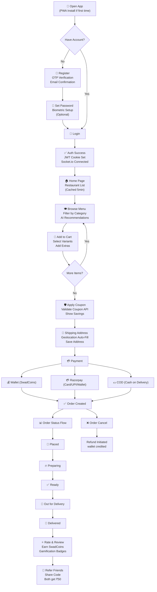

## Restaurant Owner Workflow

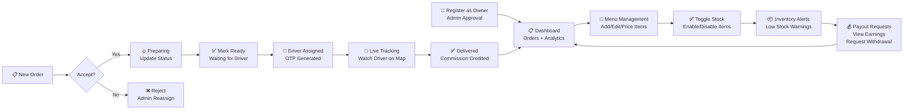

## Delivery Partner Workflow

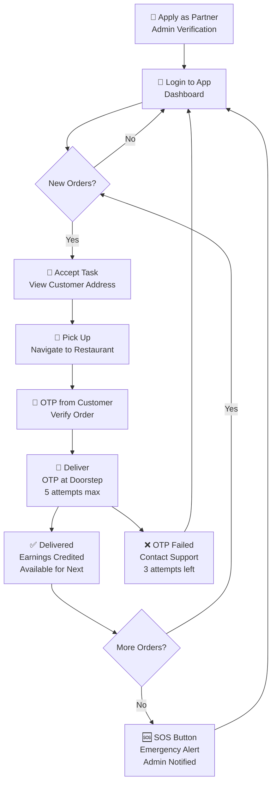

## Admin Workflow

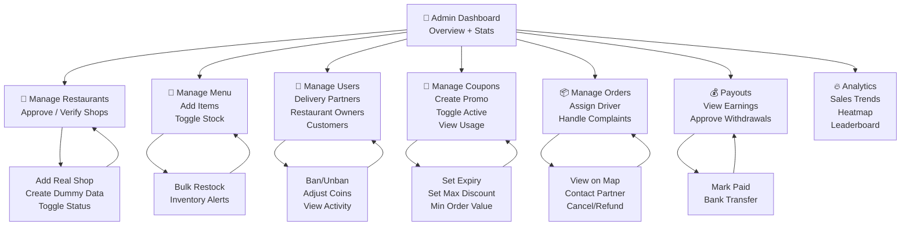

## Edge Cases & Handling

### 1. Payment Failure

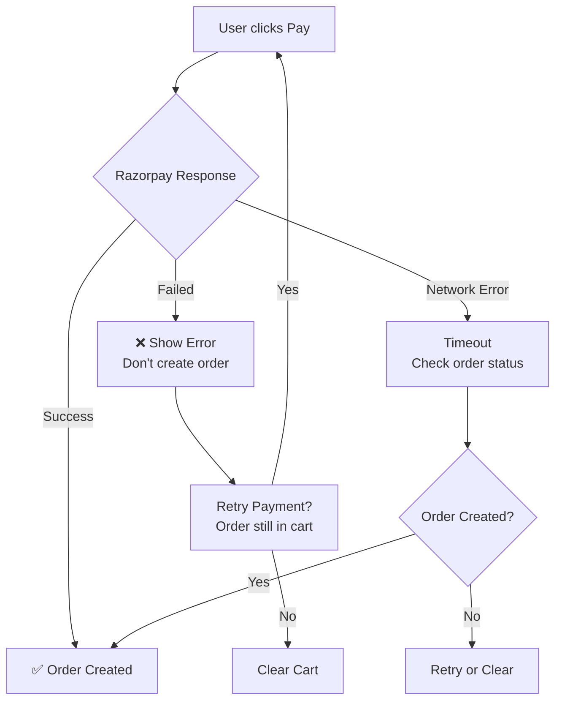

### 2. Stock Out (Out of Stock)

```mermaid
flowchart TD
    A["User adds item to cart"] --> B[Backend check: countInStock]
    B --> C{Stock available?}
    C -->|Yes| D["✅ Added to Cart"]
    C -->|No| E["❌ Show: Out of Stock<br/>Disable Add button"]
    E --> F["Suggest Similar Items<br/>Show alternatives"]

    D --> G["Proceed to Checkout"] --> H["Final Stock Re-check"]
    H --> I{Stock Changed?}
    I -->|No| J["Create Order"]
    I -->|Yes (stock=0)| K["❌ Item removed<br/>Show toast notification<br/>Cart updated"]
    K --> L["Continue Checkout<br/>Without item"]
```

### 3. Offline PWA Flow

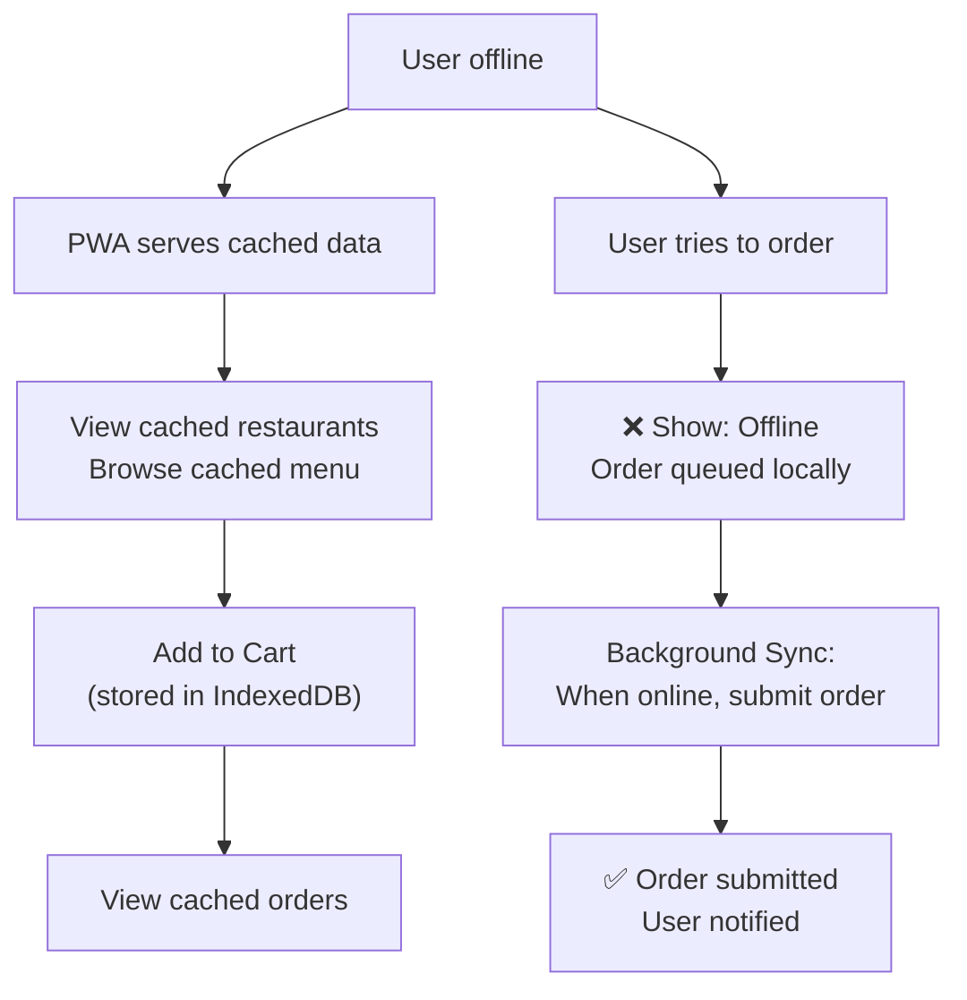

### 4. Concurrent Coupon Usage

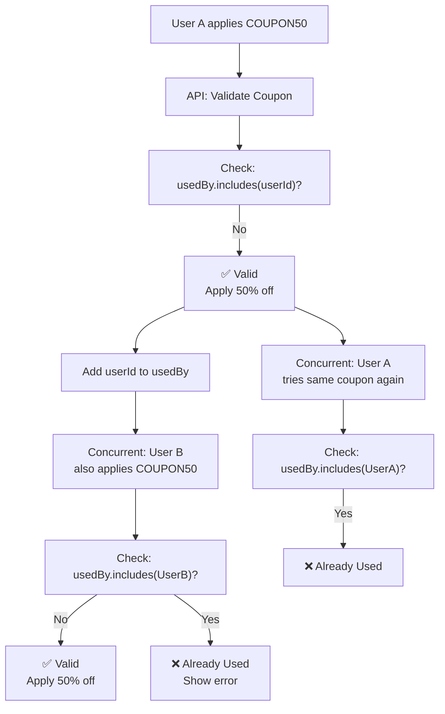

### 5. Order Cancellation (by user)

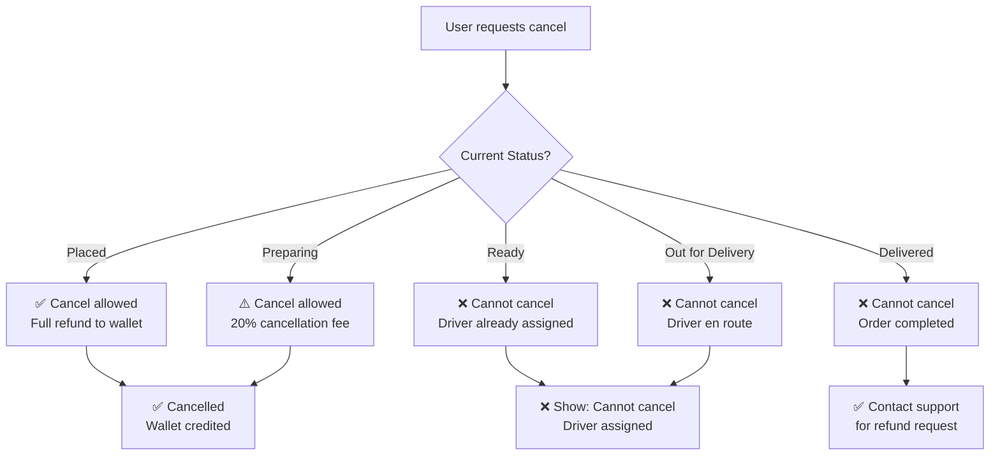

### 6. Biometric Auth Flow

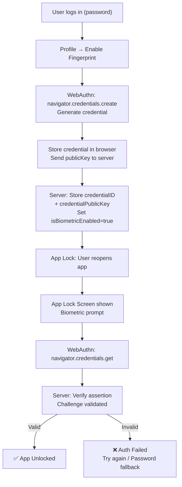

### 7. Surge Pricing Flow

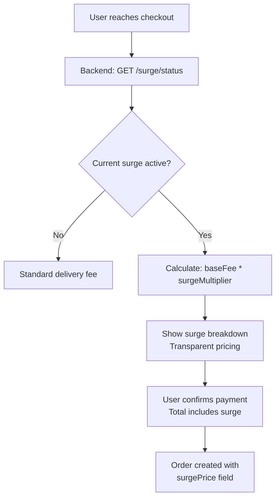

### 8. Group Order Flow

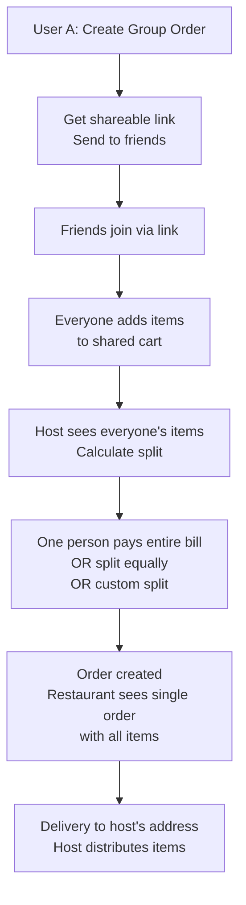

### 9. SwadPass Subscription Flow

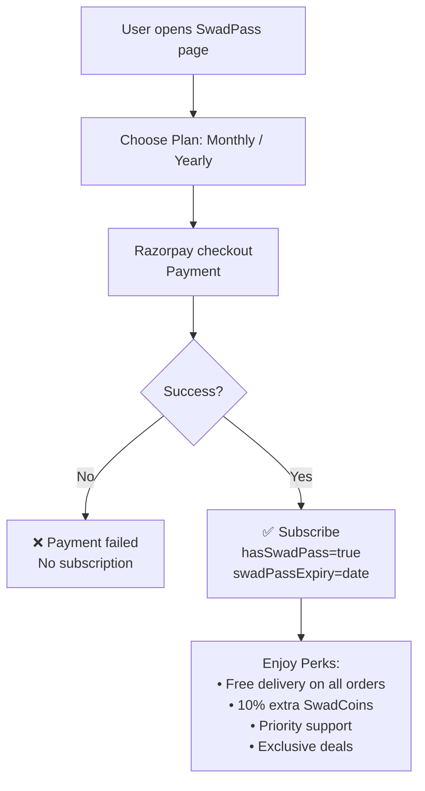

### 10. Wallet + Refund Flow

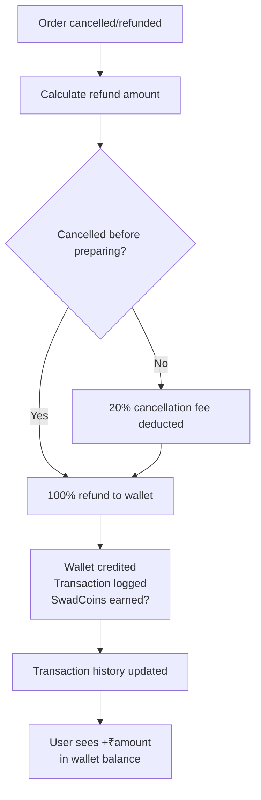

## Error Handling Matrix

| Scenario | Backend Response | Frontend Action |
|----------|-----------------|----------------|
| Invalid coupon | `400: Coupon not found or expired` | Show error, keep cart |
| Out of stock | `400: Item out of stock` | Remove from cart, show alternatives |
| Payment failed | `400: Payment verification failed` | Show retry option |
| Unauthorized | `401: Not authorized` | Redirect to login |
| Rate limited | `429: Too many requests` | Show cooldown message |
| Server error | `500: Server error` | Show "Try again later" |
| No delivery partner | `400: No partner available` | Queue order, notify when assigned |
| Order already delivered | `400: Cannot modify delivered order` | Disable cancel button |
| Biometric failed | `401: Biometric verification failed` | Password fallback |
| Socket disconnect | Socket emits `disconnect` | Show offline banner |
| Redis down | Fallback to in-memory Map | App works normally |

---

## 🧮 Enterprise Calculator Workflows

### 1. Food Cost Calculator Flow

```
Restaurant Owner opens Dashboard → Calculators tab → Cost sub-tab
       ↓
  GET /api/v1/cost-calculator/menu
       ↓
  Displays: table of all items with margin status (healthy/low/underpriced/overpriced)
       ↓
  Owner clicks "Details" on an item
       ↓
  GET /api/v1/cost-calculator/item/:productId
       ↓
  Shows: ingredient breakdown, total cost, suggested price, current profit margin
       ↓
  Owner clicks "Edit Ingredients"
       ↓
  PUT /api/v1/cost-calculator/item/:productId (with updated ingredients array)
       ↓
  Backend recalculates: totalCost = Σ(quantity × unitCost) + prepCost + packagingCost
                     suggestedPrice = totalCost / (1 - foodCostPercentage/100)
                     profitAtCurrentPrice = currentPrice - totalCost
       ↓
  Owner saves → dashboard shows updated margin status
```

### 2. Pricing Tier Calculator Flow

```
Owner enters: basePrice, costPrice, surgeMultiplier
       ↓
  POST /api/v1/pricing-calculator/pricing-tiers
       ↓
  Backend calculates 5 tiers:
    - Minimum (Cost + 10%): costPrice × 1.1
    - Standard (25% margin): costPrice / 0.75
    - Premium (35% margin): costPrice / 0.65
    - Competitive (15% margin): costPrice / 0.85
    - With Surge (custom multiplier): basePrice × surgeMultiplier
       ↓
  Shows: current margin, recommended price, all tier options
       ↓
  Owner compares against competitor prices from:
  GET /api/v1/pricing-calculator/market-pricing?category=Pizza
       ↓
  Backend aggregates: average, median, min, max per category
  Price distribution: ₹0-100, ₹101-200, ₹201-300, ₹301-500, ₹500+
```

### 3. Delivery Fee Calculator Flow

```
System calculates based on:
  - distanceKm (from coordinates)
  - orderSubtotal (order value)
  - hasSwadPass (user subscription status)
  - isSurgeActive (surge pricing config)
       ↓
  POST /api/v1/delivery-calculator/fee
       ↓
  Logic:
    if hasSwadPass → FREE
    else if orderSubtotal >= ₹500 → FREE
    else:
      distanceSurcharge = min(distanceKm × 8, 50)
      baseWithDistance = baseFee (40) + distanceSurcharge
      if surgeActive: baseWithDistance × surgeMultiplier
      total = min(baseWithDistance, maxDeliveryFee 120)
       ↓
  Returns: breakdown of all fees, surge amount, free delivery reason
```

### 4. Revenue Projection Flow

```
GET /api/v1/analytics-forecast/revenue-projection?days=30
       ↓
  Backend aggregates: daily revenue from last 30 days
       ↓
  Calculates:
    - totalRevenue, totalOrders, avgOrderValue
    - avgDailyRevenue, revenueStdDev
    - weeklyProjection = avgDailyRevenue × 7
    - monthlyProjection = avgDailyRevenue × 30
       ↓
  Projects next 7 days using day-of-week multiplier:
    [Sun: 0.6, Mon: 1.0, Tue: 0.9, Wed: 1.1, Thu: 1.2, Fri: 1.4, Sat: 1.3]
       ↓
  Confidence levels: high (3 days), medium (5 days), low (7 days)
       ↓
  Displays: historical chart + 7-day forecast bars
```

### 5. Inventory Forecasting Flow

```
GET /api/v1/inventory-forecast/forecast?days=7
       ↓
  Backend aggregates: items sold per product (last 7 days)
       ↓
  For each product:
    avgDailyDemand = soldLast7Days / 7
    daysUntilStockout = currentStock / avgDailyDemand
       ↓
  Classification:
    - out_of_stock: currentStock === 0
    - critical: daysUntilStockout <= 2
    - low: daysUntilStockout <= 5
    - healthy: daysUntilStockout > 5
       ↓
  Auto-disable products with stock <= 3 (if autoDisable enabled)
       ↓
  Shows: summary cards (total, out, critical, low, healthy) + sortable table
       ↓
  Owner sees: restock recommendations with suggestedReorderQty
```

### 6. Driver Earnings Calculator Flow

```
Driver enters: distanceKm, orderValue, isPeakHour, isSurgeActive, vehicleType
       ↓
  POST /api/v1/driver-earnings/calculate
       ↓
  Backend calculates base earnings:
    bicycle: base=10, perKm=3, perMinute=0.5
    scooter: base=15, perKm=5, perMinute=1
    bike: base=20, perKm=6, perMinute=1.5
       ↓
  Breakdown:
    base + distancePay + tipShare + surgeBonus + peakBonus + promoBonus
       ↓
  Platform cut: 10% of subtotal
  Net earnings: subtotal - platformCut
       ↓
  GET /api/v1/driver-earnings/incentives
       ↓
  Shows: milestone progress, weekly targets, bonus earnings
       ↓
  Milestone tiers:
    30 deliveries → ₹500 bonus
    50 deliveries → ₹1000 bonus
    100 deliveries → ₹2500 bonus
    200 deliveries → ₹6000 bonus
```

---

## Index

| Route | Controller | Auth |
|-------|-----------|------|
| `GET /cost-calculator/item/:id` | calculateItemCost | restaurant_owner, admin |
| `PUT /cost-calculator/item/:id` | updateItemCost | restaurant_owner, admin |
| `GET /cost-calculator/menu` | getMenuCostAnalysis | restaurant_owner, admin |
| `POST /cost-calculator/batch` | calculateBatchCost | restaurant_owner, admin |
| `GET /pricing-calculator/commission/:orderId` | calculateCommission | admin, restaurant_owner |
| `GET /pricing-calculator/commission-breakdown` | getCommissionBreakdown | admin |
| `POST /pricing-calculator/pricing-tiers` | calculatePricingTiers | restaurant_owner, admin |
| `GET /pricing-calculator/market-pricing` | getMarketPricing | admin, restaurant_owner |
| `POST /delivery-calculator/fee` | calculateDeliveryFee | user, admin |
| `POST /delivery-calculator/route` | calculateDeliveryRoute | delivery_partner, admin |
| `GET /delivery-calculator/earnings` | getDeliveryEarningsProjection | delivery_partner, admin |
| `GET /rewards-calculator/tiers` | getLoyaltyTiers | public |
| `POST /rewards-calculator/earn` | calculateCoinEarnings | protected |
| `POST /rewards-calculator/redeem` | calculateCoinRedemption | protected |
| `GET /rewards-calculator/referral` | calculateReferralReward | protected |
| `GET /rewards-calculator/breakdown` | getRewardBreakdown | protected |
| `GET /analytics-forecast/revenue-projection` | getRevenueProjection | admin, restaurant_owner |
| `GET /analytics-forecast/order-forecast` | getOrderVolumeForecast | admin, restaurant_owner |
| `GET /analytics-forecast/demand` | getDemandAnalytics | admin, restaurant_owner |
| `GET /analytics-forecast/profit-loss` | getProfitLossProjection | admin |
| `GET /inventory-forecast/forecast` | getInventoryForecast | restaurant_owner, admin |
| `GET /inventory-forecast/reorder` | getReorderRecommendations | restaurant_owner, admin |
| `GET /inventory-forecast/waste` | getWasteAnalysis | restaurant_owner, admin |
| `POST /driver-earnings/calculate` | calculateDriverEarnings | delivery_partner, admin |
| `GET /driver-earnings/payout-history` | getDriverPayoutHistory | delivery_partner, admin |
| `GET /driver-earnings/incentives` | getDriverIncentives | delivery_partner, admin |